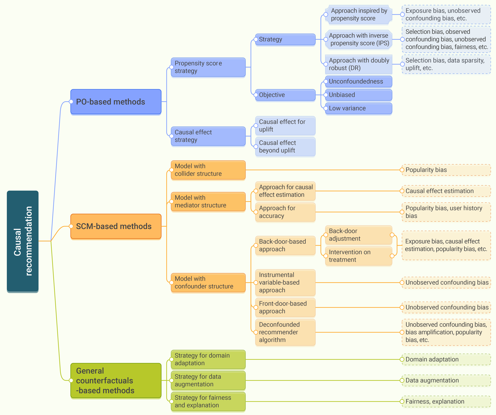
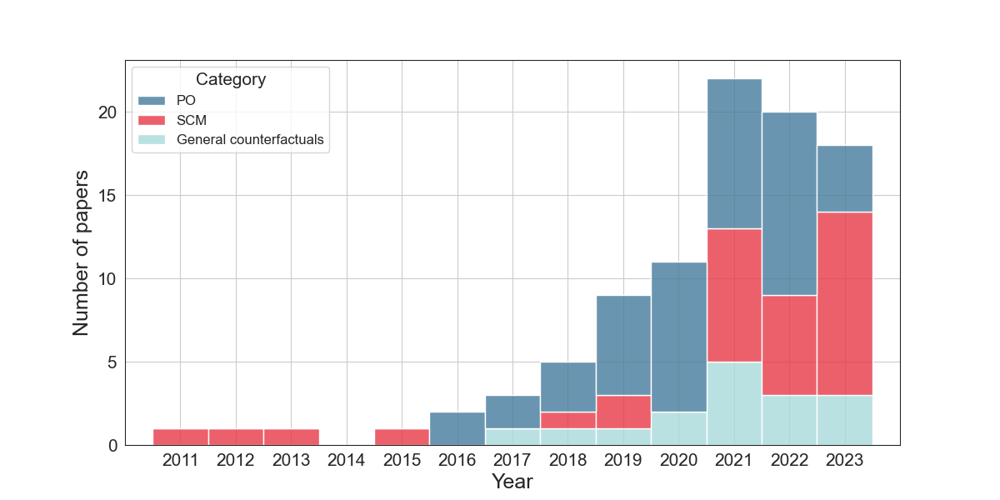
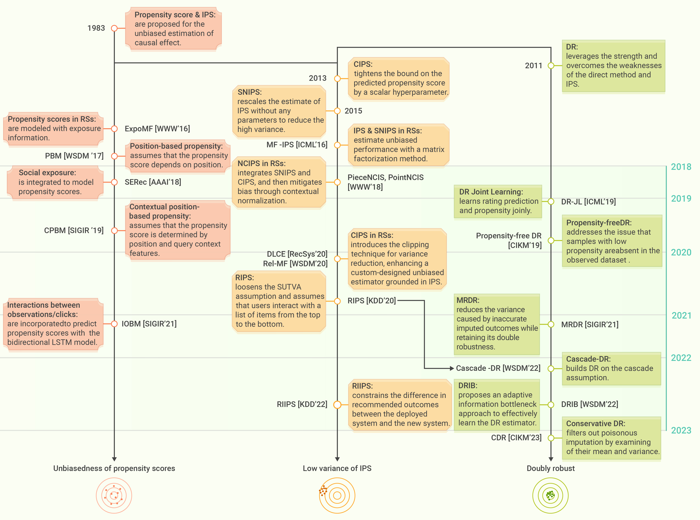
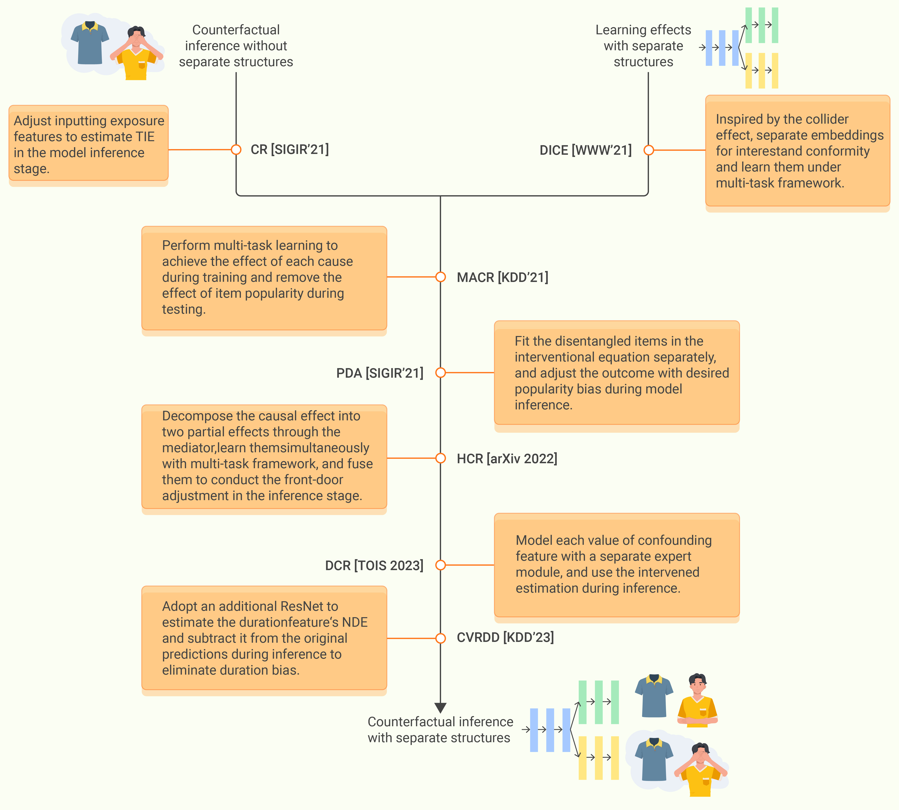

# Causal-Inference-for-Recommendation
A comprehensive repository featuring research works on causal inference for recommender systems, including both academic papers and their corresponding code implementations :fire:. For any inquiries or contributions, please contact hsluo2000@buaa.edu.cn or hsluo2000@gmail.com. We welcome any interesting papers or code related to this field. If you find this repository useful to your research or work, we would greatly appreciate a star on the repository :heart:. 


[stars-img]: https://img.shields.io/github/stars/Chrissie-Law/Causal-Inference-for-Recommendation?color=yellow
[stars-url]: https://github.com/Chrissie-Law/Causal-Inference-for-Recommendation/stargazers
[fork-img]: https://img.shields.io/github/forks/Chrissie-Law/Causal-Inference-for-Recommendation?color=lightblue&label=fork
[fork-url]: https://github.com/Chrissie-Law/Causal-Inference-for-Recommendation/network/members
[CI4RS-url]: https://github.com/Chrissie-Law/Causal-Inference-for-Recommendation

[![GitHub stars][stars-img]][stars-url]
[![GitHub forks][fork-img]][fork-url]

If this repository or our survey paper is beneficial for your work, please cite: 
```
@article{luo2024ci4rs,
  title = {A survey on causal inference for recommendation},
  journal = {The Innovation},
  volume = {5},
  number = {2},
  pages = {100590},
  year = {2024},
  issn = {2666-6758},
  doi = {https://doi.org/10.1016/j.xinn.2024.100590},
  url = {https://www.cell.com/the-innovation/fulltext/S2666-6758(24)00028-6},
  author = {Luo, Huishi and Zhuang, Fuzhen and Xie, Ruobing and Zhu, Hengshu and Wang, Deqing and An, Zhulin and Xu, Yongjun}
}
```
Due to space limitations in the official publication in [The Innovation](https://doi.org/10.1016/j.xinn.2024.100590), some figures and complete bibliographic tables are included in the supplemental material, which may be inconvenient for reading. **We strongly recommend consulting our [arXiv version](https://arxiv.org/pdf/2303.11666) :sparkles: of the paper for reading**, where all figures and bibliographic tables are positioned near the relevant text in the main document, significantly enhancing readability.

## Usage Guide

This repository offers a systematic review of research papers in the field of causal inference for recommendation systems, similar to the structure of the original survey. We categorize all works into three main types based on the causal inference theories they employ:

- **PO-based (Potential Outcome)**
- **SCM-based (Structural Causal Model)**
- **General Counterfactuals-based**

The comprehensive taxonomy is illustrated in the figure below. In addition, we have summarized the specific application problems that these works address within recommendation systems, which are listed in the "Issue of concern" column of our tables. Use the search function to quickly locate works relevant to your interests.

<div align="center">
    <figure>
        
        <figcaption>Figure 1: Strategies of the Causal Inference for Recommendation</figcaption>
    </figure>
</div>


## Project Updates

This repository is actively updated with the latest research papers up to early 2024. Updates will continue with new publications on causal inference for recommendation systems. Stay tuned!

## Bookmarks <span id="bookmarks"></span>
- [Survey Papers](#survey-papers)
  - [Distinctive Features of Our Work](#distinctive-features-of-our-work)
- [PO-based Methods](#po-based-methods)
  - [Propensity Score Strategy](#propensity-score-strategy)
    - [Approach Inspired by Propensity Score](#approach-inspired-by-propensity-score)
    - [Approach with Doubly Robust](#approach-with-doubly-robust)
  - [Causal Effect Strategy](#causal-effect-strategy)
    - [Causal Effect for Uplift](#causal-effect-for-uplift)
    - [Causal Effect beyond Uplift](#causal-effect-beyond-uplift)
- [SCM-based Methods](#scm-based-methods)
  - [Causal Recommendation with Collider Structure](#causal-recommendation-with-collider-structure)
  - [Causal Recommendation with Mediator Structure](#causal-recommendation-with-mediator-structure)
  - [Causal Recommendation with Confounder Structure](#causal-recommendation-with-confounder-structure)
- [General Counterfactuals-based Methods](#general-counterfactuals-based-methods)
  - [Domain Adaptation](#domain-adaptation)
  - [Data Augmentation](#data-augmentation)
  - [Fairness](#fairness)
  - [Explanation](#explanation)

## Survey Papers
| **Year**   | **Title**                                                                                     |  **Venue**    |                                       **Paper**                                            | **Code** |
| ---- |----------------------------------------------------------------------------------|:--------:|:---------------------------------------------------------------------------------:|:----:|
| 2024  | **A Survey on Causal Inference for Recommendation (Ours)**   |  The Innovation  | [The Innovation](https://doi.org/10.1016/j.xinn.2024.100590),<br>[:sparkles:**Recommended:arXiv**](https://arxiv.org/pdf/2303.11666) | [Link](https://github.com/Chrissie-Law/Causal-Inference-for-Recommendation)     |
| 2022  |  **Causal Inference in Recommender Systems: A Survey and Future Directions**  |  TOIS    | [Link](https://dl.acm.org/doi/abs/10.1145/3639048)  | [Link](https://github.com/tsinghua-fib-lab/Causal-Recommender-Systems)  |
| 2022 |  **On the opportunity of causal learning in recommendation systems: Foundation, estimation, prediction and challenges** |  IJCAI    | [Link](https://www.ijcai.org/proceedings/2022/0787.pdf)  | - |
| 2023 | **Causal Inference for Recommendation: Foundations, Methods and Applications** |  arXiv    |  [Link](https://arxiv.org/pdf/2301.04016) | - |
| 2023 | **Causal Inference in Recommender Systems: A Survey of Strategies for Bias Mitigation, Explanation, and Generalization** |  arXiv    | [Link](https://arxiv.org/pdf/2301.00910) | - |

### Distinctive Features of Our Work
Our study on causal inference in recommender systems is distinguished by the following aspects:

* **Theoretically coherent classification framework from a causal perspective.** We adopts a more nuanced and theory-driven classification of causal recommender systems, categorizing algorithms into PO-based (Potential Outcome), SCM-based (Structural Causal Model), and general counterfactuals-based. This taxonomy offers a more structured and holistic understanding of causal theories, beneficial especially for newcomers in causal inference.
* **Evolution of Causal Methods in Recommender Systems.** We trace the developmental trajectory of the integration between prevalent causal inference theories and recommender systems.
* **Up-to-Date Collection and Review.** Our survey encompasses a comprehensive collection of recent works, as illustrated below.


<div align="center">
    
    <p><strong>Figure 2:</strong> Distribution of publications on causal recommendations by year and framework, <br>focusing exclusively on specific industrial algorithms and excluding fundamental theory discussions.</p>
</div>


[Back](#bookmarks-)

## PO-based Methods

### Propensity Score Strategy

<div align="center">
    
    <p><strong>Figure 3:</strong> Evolutionary Timeline of Propensity Score Strategies in Recommendations.</p>
</div>

#### Approach Inspired by Propensity Score

<table>
  <thead>
    <tr style="text-align: center;">
      <th>Year</th>
      <th>Model</th>
      <th>Title</th>
      <th>Venue</th>
      <th>Issue of concern</th>
      <th>Causal inference method</th>
      <th>Base model</th>
      <th>Paper Link</th>
      <th>Code Link</th>
    </tr>
  </thead>
  <tbody>
    <tr>
      <td>2016</td>
      <td>ExpoMF</td>
      <td>Modeling User Exposure in Recommendation</td>
      <td>WWW</td>
      <td>Exposure bias</td>
      <td>Propensity score</td>
      <td>Matrix factorization</td>
      <td><a href="https://dl.acm.org/doi/abs/10.1145/2872427.2883090">Link</a></td>
      <td><a href="https://github.com/dawenl/expo-mf">Link</a></td>
    </tr>
    <tr>
      <td>2018</td>
      <td>SERec</td>
      <td>Collaborative Filtering with Social Exposure: A Modular Approach to Social Recommendation</td>
      <td>AAAI</td>
      <td>Social recommendation</td>
      <td>Propensity score</td>
      <td>Matrix factorization</td>
      <td><a href="https://ojs.aaai.org/index.php/AAAI/article/view/11835">Link</a></td>
      <td><a href="https://github.com/99731/SERec">Link</a></td>
    </tr>
    <tr>
      <td>2020</td>
      <td>Dcf</td>
      <td>Causal Inference for Recommender Systems</td>
      <td>RecSys</td>
      <td>Unobserved confounding bias</td>
      <td>Propensity score</td>
      <td>Matrix factorization</td>
      <td><a href="https://dl.acm.org/doi/abs/10.1145/3383313.3412225">Link</a></td>
      <td>-</td>
    </tr>
    <tr>
      <td>2021</td>
      <td>CNFI</td>
      <td>Causal neural fuzzy inference modeling of missing data in implicit recommendation system</td>
      <td>KBS</td>
      <td>Implicit feedback</td>
      <td>Propensity score</td>
      <td>MF</td>
      <td><a href="https://www.sciencedirect.com/science/article/pii/S0950705120308078">Link</a></td>
      <td>-</td>
    </tr>
    <tr>
      <td>2021</td>
      <td>IOBM</td>
      <td>Adapting Interactional Observation Embedding for Counterfactual Learning to Rank</td>
      <td>SIGIR</td>
      <td>Interactional observation bias</td>
      <td>Propensity score</td>
      <td>Bi-LSTM</td>
      <td><a href="https://dl.acm.org/doi/10.1145/3404835.3462901">Link</a></td>
      <td><a href="https://github.com/Keytoyze/Interactional-Observation-Based-Model">Link</a></td>
    </tr>
    <tr>
      <td>2023</td>
      <td>CCL</td>
      <td>Contrastive Counterfactual Learning for Causality-aware Interpretable Recommender Systems</td>
      <td>CIKM</td>
      <td>Unobserved confounding bias</td>
      <td>Propensity score</td>
      <td>(custom-designed)</td>
      <td><a href="https://dl.acm.org/doi/abs/10.1145/3583780.3614823">Link</a></td>
      <td>-</td>
    </tr>
  </tbody>
</table>

[Back](#bookmarks-)

#### Approach with Doubly Robust

<table>
  <thead>
    <tr style="text-align: center;">
      <th>Year</th>
      <th>Model</th>
      <th>Title</th>
      <th>Venue</th>
      <th>Issue of concern</th>
      <th>Causal inference method</th>
      <th>Base model</th>
      <th>Paper Link</th>
      <th>Code Link</th>
    </tr>
  </thead>
  <tbody>
    <tr>
      <td>2019</td>
      <td>Propensity-free DR</td>
      <td>Improving Ad Click Prediction by Considering Non-displayed Events</td>
      <td>CIKM</td>
      <td>Selection bias</td>
      <td>DR</td>
      <td>FFM</td>
      <td><a href="https://dl.acm.org/doi/abs/10.1145/3357384.3358058">Link</a></td>
      <td>-</td>
    </tr>
    <tr>
      <td>2019</td>
      <td>DR-JL</td>
      <td>Doubly Robust Joint Learning for Recommendation on Data Missing Not at Random</td>
      <td>ICML</td>
      <td>Selection Bias</td>
      <td>DR</td>
      <td>MF</td>
      <td><a href="https://proceedings.mlr.press/v97/wang19n.html">Link</a></td>
      <td>-</td>
    </tr>
    <tr>
      <td>2020</td>
      <td>Multi-DR</td>
      <td>Large-scale Causal Approaches to Debiasing Post-click Conversion Rate Estimation with Multi-task Learning</td>
      <td>WWW</td>
      <td>Selection bias</td>
      <td>DR</td>
      <td>Multi-task MLP</td>
      <td><a href="https://dl.acm.org/doi/abs/10.1145/3366423.3380037">Link</a></td>
      <td>-</td>
    </tr>
    <tr>
      <td>2021</td>
      <td>MRDR-DL</td>
      <td>Enhanced Doubly Robust Learning for Debiasing Post-Click Conversion Rate Estimation</td>
      <td>SIGIR</td>
      <td>Selection bias</td>
      <td>MRDR</td>
      <td>Matrix factorization</td>
      <td><a href="https://dl.acm.org/doi/abs/10.1145/3404835.3462917">Link</a></td>
      <td><a href="https://github.com/guosyjlu/MRDR-DL">Link</a></td>
    </tr>
    <tr>
      <td>2022</td>
      <td>Cascade-DR</td>
      <td>Doubly Robust Off-Policy Evaluation for Ranking Policies under the Cascade Behavior Model</td>
      <td>WSDM</td>
      <td>High variance of RIPS</td>
      <td>Cascade-DR</td>
      <td>Matrix factorization</td>
      <td><a href="https://dl.acm.org/doi/abs/10.1145/3488560.3498380">Link</a></td>
      <td><a href="https://github.com/aiueola/wsdm2022-cascade-dr">Link</a></td>
    </tr>
    <tr>
      <td>2022</td>
      <td>ASPIRE</td>
      <td>ASPIRE: Air Shipping Recommendation for E-commerce Products via Causal Inference Framework</td>
      <td>KDD</td>
      <td>Uplift</td>
      <td>DR, ATE</td>
      <td>LightGBM</td>
      <td><a href="https://dl.acm.org/doi/abs/10.1145/3534678.3539197">Link</a></td>
      <td>-</td>
    </tr>
    <tr>
      <td>2022</td>
      <td>DRIB</td>
      <td>Towards Unbiased and Robust Causal Ranking for Recommender Systems</td>
      <td>WSDM</td>
      <td>Unobserved confoundeing bias</td>
      <td>DR</td>
      <td>Matrix factorization</td>
      <td><a href="https://dl.acm.org/doi/abs/10.1145/3488560.3498521">Link</a></td>
      <td>-</td>
    </tr>
    <tr>
      <td>2022</td>
      <td>DR-BIAS, DR-MSE</td>
      <td>A Generalized Doubly Robust Learning Framework for Debiasing Post-Click Conversion Rate Prediction</td>
      <td>KDD</td>
      <td>Selection Bias</td>
      <td>DR</td>
      <td>FM</td>
      <td><a href="https://dl.acm.org/doi/abs/10.1145/3534678.3539270">Link</a></td>
      <td>-</td>
    </tr>
    <tr>
      <td>2023</td>
      <td>CDR</td>
      <td>CDR: Conservative Doubly Robust Learning for Debiased Recommendation</td>
      <td>CIKM</td>
      <td>Selection bias</td>
      <td>DR</td>
      <td>MF</td>
      <td><a href="https://dl.acm.org/doi/abs/10.1145/3583780.3614805">Link</a></td>
      <td>-</td>
    </tr>
    <tr>
      <td>2023</td>
      <td>CF-MTL</td>
      <td>Who Should Be Given Incentives? Counterfactual Optimal Treatment Regimes Learning for Recommendation</td>
      <td>KDD</td>
      <td>Personalized incentive policy</td>
      <td>CATE, IPS, DR</td>
      <td>(custom-designed)</td>
      <td><a href="https://dl.acm.org/doi/abs/10.1145/3580305.3599550">Link</a></td>
      <td><a href="https://github.com/haoxuanli-pku/KDD23-Counterfactual">Link</a></td>
    </tr>
  </tbody>
</table>

[Back](#bookmarks-)

### Causal Effect Strategy

#### Causal Effect for Uplift

<table>
  <thead>
    <tr style="text-align: center;">
      <th>Year</th>
      <th>Model</th>
      <th>Title</th>
      <th>Venue</th>
      <th>Issue of concern</th>
      <th>Causal inference method</th>
      <th>Base model</th>
      <th>Paper Link</th>
      <th>Code Link</th>
    </tr>
  </thead>
  <tbody>
    <tr>
      <td>2019</td>
      <td>ULRMF, ULBPR</td>
      <td>Uplift-based evaluation and optimization of recommenders</td>
      <td>RecSys</td>
      <td rowspan="5">Uplift</td>
      <td>IPS, SNIPS, ATE</td>
      <td>MF</td>
      <td><a href="https://dl.acm.org/doi/abs/10.1145/3298689.3347018">Link</a></td>
      <td>-</td>
    </tr>
    <tr>
      <td>2020</td>
      <td>-</td>
      <td>Free Lunch! Retrospective Uplift Modeling for Dynamic Promotions Recommendation within ROI Constraints</td>
      <td>RecSys</td>
      <td>CATE</td>
      <td>Xgboost</td>
      <td><a href="https://dl.acm.org/doi/abs/10.1145/3383313.3412215">Link</a></td>
      <td>-</td>
    </tr>
    <tr>
      <td>2021</td>
      <td>AUUC-max</td>
      <td>Uplift Modeling with Generalization Guarantees</td>
      <td>KDD</td>
      <td>CATE</td>
      <td>Linear/Wide & Deep</td>
      <td><a href="https://dl.acm.org/doi/abs/10.1145/3447548.3467395">Link</a></td>
      <td>-</td>
    </tr>
    <tr>
      <td>2021</td>
      <td>CausCF</td>
      <td>Causally Attentive Collaborative Filtering</td>
      <td>CIKM</td>
      <td>CATE</td>
      <td>Matrix factorization</td>
      <td><a href="https://dl.acm.org/doi/abs/10.1145/3459637.3482070">Link</a></td>
      <td>-</td>
    </tr>
    <tr>
      <td>2022</td>
      <td>ASPIRE</td>
      <td>ASPIRE: Air Shipping Recommendation for E-commerce Products via Causal Inference Framework</td>
      <td>KDD</td>
      <td>DR, ATE</td>
      <td>LightGBM</td>
      <td><a href="https://dl.acm.org/doi/abs/10.1145/3534678.3539197">Link</a></td>
      <td>-</td>
    </tr>
  </tbody>
</table>

[Back](#bookmarks-)

#### Causal Effect beyond Uplift

<table>
  <thead>
    <tr style="text-align: center;">
      <th>Year</th>
      <th>Model</th>
      <th>Title</th>
      <th>Venue</th>
      <th>Issue of concern</th>
      <th>Causal inference method</th>
      <th>Base model</th>
      <th>Paper Link</th>
      <th>Code Link</th>
    </tr>
  </thead>
  <tbody>
    <tr>
      <td>2017</td>
      <td>-</td>
      <td>Predicting Counterfactuals from Large Historical Data and Small Randomized Trials</td>
      <td>WWW</td>
      <td>Domain adaptation</td>
      <td>ITE</td>
      <td>Linear/regularized kernel methods</td>
      <td><a href="https://dl.acm.org/doi/abs/10.1145/3041021.3054190">Link</a></td>
      <td>-</td>
    </tr>
    <tr>
      <td>2018</td>
      <td>CausE</td>
      <td>Causal Embeddings for Recommendation</td>
      <td>RecSys</td>
      <td>Domain adaptation</td>
      <td>ITE</td>
      <td>MF</td>
      <td><a href="https://dl.acm.org/doi/abs/10.1145/3240323.3240360">Link</a></td>
      <td>-</td>
    </tr>
    <tr>
      <td>2020</td>
      <td>-</td>
      <td>Inferring the Causal Impact of New Track Releases on Music Recommendation Platforms through Counterfactual Predictions</td>
      <td>RecSys</td>
      <td>Causal effect of a new track release</td>
      <td>TE</td>
      <td>Structural state-space model</td>
      <td><a href="https://dl.acm.org/doi/abs/10.1145/3383313.3418491">Link</a></td>
      <td>-</td>
    </tr>
    <tr>
      <td>2021</td>
      <td>CACF</td>
      <td>Causally Attentive Collaborative Filtering</td>
      <td>CIKM</td>
      <td>Unobserved confounding bias</td>
      <td>ITE</td>
      <td>(custom-designed)</td>
      <td><a href="https://dl.acm.org/doi/abs/10.1145/3459637.3482070">Link</a></td>
      <td><a href="https://github.com/JingsenZhang/CACF">Link</a></td>
    </tr>
    <tr>
      <td>2022</td>
      <td>MCRec</td>
      <td>Device-cloud Collaborative Recommendation via Meta Controller</td>
      <td>KDD</td>
      <td>Device-cloud collaborative recommendation</td>
      <td>CATE</td>
      <td>DIN</td>
      <td><a href="https://dl.acm.org/doi/abs/10.1145/3534678.3539181">Link</a></td>
      <td>-</td>
    </tr>
    <tr>
      <td>2022</td>
      <td>LRIR</td>
      <td>What is the Most Effective Intervention to Increase Job Retention for this Disabled Worker?</td>
      <td>KDD</td>
      <td>Disability employment</td>
      <td>ITE, ATE</td>
      <td>(custom-designed)</td>
      <td><a href="https://dl.acm.org/doi/abs/10.1145/3534678.3539026">Link</a></td>
      <td>-</td>
    </tr>
  </tbody>
</table>

[Back](#bookmarks-)

## SCM-based Methods

<div align="center">
    
    <p><strong>Figure 4:</strong> Separate-learning-counterfactual-inference, a common pattern of SCM-based causal inference for recommender systems,<br>learns causal effect with a separate structure or multi-task framework and performs counterfactual inference during testing.</p>
</div>

### Causal Recommendation with Collider Structure

<table>
  <thead>
    <tr style="text-align: center;">
      <th>Year</th>
      <th>Model</th>
      <th>Title</th>
      <th>Venue</th>
      <th>Issue of concern</th>
      <th>Causal inference method</th>
      <th>Base model</th>
      <th>Paper Link</th>
      <th>Code Link</th>
    </tr>
  </thead>
  <tbody>
    <tr>
      <td>2021</td>
      <td>DICE</td>
      <td>Disentangling User Interest and Conformity for Recommendation with Causal Embedding</td>
      <td>WWW</td>
      <td>Popularity bias</td>
      <td>(causal view)</td>
      <td>Matrix factorization (multi-task)</td>
      <td><a href="https://dl.acm.org/doi/abs/10.1145/3442381.3449788">Link</a></td>
      <td><a href="https://github.com/tsinghua-fib-lab/DICE">Link</a></td>
    </tr>
    <tr>
      <td>2022</td>
      <td>CIGC</td>
      <td>Causal Incremental Graph Convolution for Recommender System Retraining</td>
      <td>TNNLS</td>
      <td>GCN model retraining</td>
      <td>Intervention on the cause factor</td>
      <td>LightGCN</td>
      <td><a href="https://ieeexplore.ieee.org/abstract/document/9737000/">Link</a></td>
      <td><a href="https://github.com/Dingseewhole/CI_LightGCN_master">Link</a></td>
    </tr>
    <tr>
      <td>2024</td>
      <td>MGCE</td>
      <td>Multimodal Graph Causal Embedding for Multimedia-Based Recommendation</td>
      <td>TKDE</td>
      <td>Popularity bias</td>
      <td>(causal view)</td>
      <td>linear GCN</td>
      <td><a href="https://ieeexplore.ieee.org/abstract/document/10587159/">Link</a></td>
      <td><a href="https://github.com/shuaiyangli/MGCE">Link</a></td>
    </tr>
    <tr>
      <td>2023</td>
      <td>DDCE</td>
      <td>Dual disentanglement of user–item interaction for recommendation with causal embedding</td>
      <td>IPM</td>
      <td>Popularity bias</td>
      <td>(causal view)</td>
      <td>(custom-designed)</td>
      <td><a href="https://www.sciencedirect.com/science/article/pii/S0306457323001930">Link</a></td>
      <td>-</td>
    </tr>
  </tbody>
</table>

[Back](#bookmarks-)

### Causal Recommendation with Mediator Structure

<table>
  <thead>
    <tr style="text-align: center;">
      <th>Year</th>
      <th>Model</th>
      <th>Title</th>
      <th>Venue</th>
      <th>Issue of concern</th>
      <th>Causal inference method</th>
      <th>Base model</th>
      <th>Paper Link</th>
      <th>Code Link</th>
    </tr>
  </thead>
  <tbody>
    <tr>
      <td>2011</td>
      <td>-</td>
      <td>The Influence of Social Presence on Customer Intention to Reuse Online Recommender Systems: The Roles of Personalization and Product Type</td>
      <td>IJEC</td>
      <td>Effect of social presence</td>
      <td>Mediation analysis</td>
      <td>-</td>
      <td><a href="https://www.tandfonline.com/doi/abs/10.2753/JEC1086-4415160105">Link</a></td>
      <td>-</td>
    </tr>
    <tr>
      <td>2013</td>
      <td>-</td>
      <td>Impact of informational factors on online recommendation credibility: The moderating role of source credibility</td>
      <td>DSS</td>
      <td>Effect of informational factors</td>
      <td>Mediation analysis</td>
      <td>-</td>
      <td><a href="https://www.sciencedirect.com/science/article/pii/S0167923613001218">Link</a></td>
      <td>-</td>
    </tr>
    <tr>
      <td>2019</td>
      <td>CMA</td>
      <td>The Identification and Estimation of Direct and Indirect Effects in A/B Tests through Causal Mediation Analysis</td>
      <td>KDD</td>
      <td>Effect of induced change</td>
      <td>NDE, TIE</td>
      <td>-</td>
      <td><a href="https://dl.acm.org/doi/abs/10.1145/3292500.3330769">Link</a></td>
      <td><a href="https://github.com/xuanyin/causal-mediation-analysis-for-ab-tests?tab=readme-ov-file (R language)">Link</a></td>
    </tr>
    <tr>
      <td>2021</td>
      <td>MACR</td>
      <td>Model-Agnostic Counterfactual Reasoning for Eliminating Popularity Bias in Recommender System</td>
      <td>KDD</td>
      <td>Popularity bias</td>
      <td>TIE</td>
      <td>MF, LightGCN (multi-task)</td>
      <td><a href="https://dl.acm.org/doi/abs/10.1145/3447548.3467289">Link</a></td>
      <td><a href="https://github.com/weitianxin/MACR">Link</a></td>
    </tr>
    <tr>
      <td>2022</td>
      <td>CIRS</td>
      <td>CIRS: Bursting Filter Bubbles by Counterfactual Interactive Recommender System</td>
      <td>TOIS</td>
      <td>Filter bubble</td>
      <td>Intervention on the mediator</td>
      <td>PPO</td>
      <td><a href="https://dl.acm.org/doi/abs/10.1145/3594871">Link</a></td>
      <td><a href="https://github.com/chongminggao/CIRS-codes">Link</a></td>
    </tr>
    <tr>
      <td>2023</td>
      <td>CCF</td>
      <td>Causal Collaborative Filtering</td>
      <td>ICTIR</td>
      <td>Historical bias</td>
      <td>Intervention on the mediator, counterfactual data augmentation</td>
      <td>NCF, GRU4Rec, etc.</td>
      <td><a href="https://dl.acm.org/doi/abs/10.1145/3578337.3605122">Link</a></td>
      <td><a href="https://github.com/rutgerswiselab/CCF">Link</a></td>
    </tr>
  </tbody>
</table>

[Back](#bookmarks-)

### Causal Recommendation with Confounder Structure

<table>
  <thead>
    <tr style="text-align: center;">
      <th>Year</th>
      <th>Model</th>
      <th>Title</th>
      <th>Venue</th>
      <th>Issue of concern</th>
      <th>Causal inference method</th>
      <th>Base model</th>
      <th>Paper Link</th>
      <th>Code Link</th>
    </tr>
  </thead>
  <tbody>
    <tr>
      <td>2012</td>
      <td>-</td>
      <td>Exploring Social Influence via Posterior Effect of Word-of-Mouth Recommendations</td>
      <td>WSDM</td>
      <td>Effect of word- of-mouth recommendation</td>
      <td>Back-door criterion</td>
      <td>MF</td>
      <td><a href="https://dl.acm.org/doi/abs/10.1145/2124295.2124365">Link</a></td>
      <td>-</td>
    </tr>
    <tr>
      <td>2015</td>
      <td>-</td>
      <td>Estimating the Causal Impact of Recommendation Systems from Observational Data</td>
      <td>EC</td>
      <td>Effect of recommendations</td>
      <td>Back-door adjustment, instrumental variable</td>
      <td>-</td>
      <td><a href="https://dl.acm.org/doi/abs/10.1145/2764468.2764488">Link</a></td>
      <td>-</td>
    </tr>
    <tr>
      <td>2018</td>
      <td>-</td>
      <td>How Algorithmic Confounding in Recommendation Systems Increases Homogeneity and Decreases Utility</td>
      <td>RecSys</td>
      <td>Feedback loop bias</td>
      <td>(causal view)</td>
      <td>MF, etc.</td>
      <td><a href="https://dl.acm.org/doi/abs/10.1145/3240323.3240370">Link</a></td>
      <td>-</td>
    </tr>
    <tr>
      <td>2019</td>
      <td>DEMER</td>
      <td>Environment Reconstruction with Hidden Confounders for Reinforcement Learning based Recommendation</td>
      <td>KDD</td>
      <td>Unobserved confounding bias</td>
      <td>(causal view)</td>
      <td>DNN(reinforcement learning)</td>
      <td><a href="https://dl.acm.org/doi/abs/10.1145/3292500.3330933">Link</a></td>
      <td>-</td>
    </tr>
    <tr>
      <td>2021</td>
      <td>CPR</td>
      <td>Top-N Recommendation with Counterfactual User Preference Simulation</td>
      <td>CIKM</td>
      <td>Data insufficiency</td>
      <td>Intervention on the treatment</td>
      <td>MF, LightGCN, etc.</td>
      <td><a href="https://dl.acm.org/doi/abs/10.1145/3459637.3482305">Link</a></td>
      <td><a href="https://github.com/ymy4323460/CPR">Link</a></td>
    </tr>
    <tr>
      <td>2021</td>
      <td>CauSeR</td>
      <td>CauSeR: Causal Session-based Recommendations for Handling Popularity Bias</td>
      <td>CIKM</td>
      <td>Popularity bias in session-based RS</td>
      <td>Intervention on the treatment</td>
      <td>SR-GNN</td>
      <td><a href="https://dl.acm.org/doi/abs/10.1145/3459637.3482071">Link</a></td>
      <td>-</td>
    </tr>
    <tr>
      <td>2021</td>
      <td>MCT</td>
      <td>Recommending the Most Effective Intervention to Improve Employment for Job Seekers with Disability</td>
      <td>KDD</td>
      <td>Disability employment</td>
      <td>Back-door criterion, CATE</td>
      <td>(custom-designed)</td>
      <td><a href="https://dl.acm.org/doi/abs/10.1145/3447548.3467095">Link</a></td>
      <td><a href="https://github.com/trxuanha/maximumcausaltree">Link</a></td>
    </tr>
    <tr>
      <td>2021</td>
      <td>DecRS</td>
      <td>Deconfounded Recommendation for Alleviating Bias Amplification</td>
      <td>KDD</td>
      <td>Bias amplification</td>
      <td>Intervention on the treatment</td>
      <td>FM, NFM</td>
      <td><a href="https://dl.acm.org/doi/abs/10.1145/3447548.3467249">Link</a></td>
      <td><a href="https://github.com/WenjieWWJ/DecRS">Link</a></td>
    </tr>
    <tr>
      <td>2021</td>
      <td>PDA</td>
      <td>Causal Intervention for Leveraging Popularity Bias in Recommendation</td>
      <td>SIGIR</td>
      <td>Popularity bias</td>
      <td>Intervention on the treatment</td>
      <td>MF</td>
      <td><a href="https://dl.acm.org/doi/abs/10.1145/3404835.3462875">Link</a></td>
      <td><a href="https://github.com/zyang1580/PDA">Official TensorFlow</a>, <a href="https://github.com/GHxdc/PDA">Reproduced PyTorch</a></td>
    </tr>
    <tr>
      <td>2021</td>
      <td>CR</td>
      <td>Clicks can be Cheating: Counterfactual Recommendation for Mitigating Clickbait Issue</td>
      <td>SIGIR</td>
      <td>Clickbait</td>
      <td>Back-door criterion, TIE</td>
      <td>MMGCN</td>
      <td><a href="https://dl.acm.org/doi/abs/10.1145/3404835.3462962">Link</a></td>
      <td><a href="https://github.com/WenjieWWJ/Clickbait/">Link</a></td>
    </tr>
    <tr>
      <td>2022</td>
      <td>D2Q</td>
      <td>Deconfounding Duration Bias in Watch-time Prediction for Video Recommendation</td>
      <td>KDD</td>
      <td>Duration bias</td>
      <td>Intervention on the treatment</td>
      <td>(custom-designed)</td>
      <td><a href="https://dl.acm.org/doi/abs/10.1145/3534678.3539092">Link</a></td>
      <td>-</td>
    </tr>
    <tr>
      <td>2022</td>
      <td>DeSCoVeR</td>
      <td>DeSCoVeR: Debiased Semantic Context Prior for Venue Recommendation</td>
      <td>SIGIR</td>
      <td>Venue recommendation</td>
      <td>Intervention on the treatment</td>
      <td>(custom-designed)</td>
      <td><a href="https://dl.acm.org/doi/abs/10.1145/3477495.3531877">Link</a></td>
      <td>-</td>
    </tr>
    <tr>
      <td>2022</td>
      <td>IV4Rec</td>
      <td>A Model-Agnostic Causal Learning Framework for Recommendation using Search Data</td>
      <td>WWW</td>
      <td>Recommendation using search data</td>
      <td>IV</td>
      <td>DIN, NRHUB</td>
      <td><a href="https://dl.acm.org/doi/abs/10.1145/3485447.3511951">Link</a></td>
      <td><a href="https://github.com/ethan00si/instrumental-variables-for-recommendation">Link</a></td>
    </tr>
    <tr>
      <td>2022</td>
      <td>HCR</td>
      <td>Mitigating Hidden Confounding Effects for Causal Recommendation</td>
      <td>TKDE</td>
      <td>Unobserved confounding bias</td>
      <td>Front-door adjustment</td>
      <td>MMGCN</td>
      <td><a href="https://ieeexplore.ieee.org/abstract/document/10474183/">Link</a></td>
      <td>-</td>
    </tr>
    <tr>
      <td>2023</td>
      <td>DCR</td>
      <td>Addressing Confounding Feature Issue for Causal Recommendation</td>
      <td>TOIS</td>
      <td>Unobserved confounding bias</td>
      <td>Intervention on the treatment</td>
      <td>NFM</td>
      <td><a href="https://dl.acm.org/doi/abs/10.1145/3559757">Link</a></td>
      <td><a href="https://github.com/zyang1580/DCR">Link</a></td>
    </tr>
    <tr>
      <td>2023</td>
      <td>CaDSI</td>
      <td>Causal Disentanglement for Semantic-Aware Intent Learning in Recommendation</td>
      <td>TKDE</td>
      <td>Observed confounding bias</td>
      <td>Intervention on the treatment</td>
      <td>(custom-designed)</td>
      <td><a href="https://ieeexplore.ieee.org/abstract/document/9736612/">Link</a></td>
      <td>-</td>
    </tr>
    <tr>
      <td>2023</td>
      <td>DecUCB</td>
      <td>User-Regulation Deconfounded Conversational Recommender System with Bandit Feedback</td>
      <td>KDD</td>
      <td>Observed confounding bias</td>
      <td>Back-door adjustment</td>
      <td>bandit</td>
      <td><a href="https://dl.acm.org/doi/abs/10.1145/3580305.3599539">Link</a></td>
      <td>-</td>
    </tr>
    <tr>
      <td>2023</td>
      <td>iDCF</td>
      <td>Debiasing Recommendation by Learning Identifiable Latent Confounders</td>
      <td>KDD</td>
      <td>Unobserved confounding bias</td>
      <td>Proxy Variable</td>
      <td>MF</td>
      <td><a href="https://dl.acm.org/doi/abs/10.1145/3580305.3599296">Link</a></td>
      <td><a href="https://github.com/BgmLover/iDCF">Link</a></td>
    </tr>
    <tr>
      <td>2023</td>
      <td>CVRDD</td>
      <td>Counterfactual Video Recommendation for Duration Debiasing</td>
      <td>KDD</td>
      <td>Duration bias</td>
      <td>TIE</td>
      <td>MLP(model-agnostic)</td>
      <td><a href="https://dl.acm.org/doi/abs/10.1145/3580305.3599797">Link</a></td>
      <td>-</td>
    </tr>
    <tr>
      <td>2023</td>
      <td>DML</td>
      <td>Leveraging Watch-time Feedback for Short-Video Recommendations: A Causal Labeling Framework</td>
      <td>CIKM</td>
      <td>Duration bias</td>
      <td>Back-door adjustment</td>
      <td>MMoE</td>
      <td><a href="https://dl.acm.org/doi/abs/10.1145/3583780.3615483">Link</a></td>
      <td><a href="https://github.com/baiyimeng/DML">Link</a></td>
    </tr>
    <tr>
      <td>2023</td>
      <td>CGSR</td>
      <td>Causality-guided Graph Learning for Session-based Recommendation</td>
      <td>CIKM</td>
      <td>Shortcut paths in SBRSs</td>
      <td>Back-door adjustment</td>
      <td>(custom-designed)</td>
      <td><a href="https://dl.acm.org/doi/abs/10.1145/3583780.3614803">Link</a></td>
      <td>-</td>
    </tr>
    <tr>
      <td>2023</td>
      <td>-</td>
      <td>Evaluating Digital Agriculture Recommendations with Causal Inference</td>
      <td>AAAI</td>
      <td>Digital agriculture</td>
      <td>Back-door adjustment, IPS</td>
      <td>(custom-designed, knowledge-based RS)</td>
      <td><a href="https://ojs.aaai.org/index.php/AAAI/article/view/26697">Link</a></td>
      <td><a href="https://github.com/Agri-Hub/AAAI23-Eval-AgriRecommendations">Link</a></td>
    </tr>
  </tbody>
</table>

[Back](#bookmarks-)

## General Counterfactuals-based Methods

The "General Counterfactuals" methods are categorized based on the "Issue of Concern," meaning that the category titles reflect the specific application issues they aim to address within recommender systems, including domain adaptation, data augmentation, fairness, and explanation.


### Domain Adaptation

<table>
  <thead>
    <tr style="text-align: center;">
      <th>Year</th>
      <th>Model</th>
      <th>Title</th>
      <th>Venue</th>
      <th>Causal inference method</th>
      <th>Backbone model</th>
      <th>Paper Link</th>
      <th>Code Link</th>
    </tr>
  </thead>
  <tbody>
    <tr>
      <td>2017</td>
      <td>-</td>
      <td>Predicting Counterfactuals from Large Historical Data and Small Randomized Trials</td>
      <td>WWW</td>
      <td>ITE</td>
      <td>Linear/regularized kernel methods</td>
      <td><a href="https://dl.acm.org/doi/abs/10.1145/3041021.3054190">Link</a></td>
      <td>-</td>
    </tr>
    <tr>
      <td>2018</td>
      <td>-</td>
      <td>Causal Embeddings for Recommendation</td>
      <td>RecSys</td>
      <td>ITE</td>
      <td>Matrix factorization</td>
      <td><a href="https://dl.acm.org/doi/abs/10.1145/3240323.3240360">Link</a></td>
      <td>-</td>
    </tr>
    <tr>
      <td>2019</td>
      <td>Propensity-free DR</td>
      <td>Improving Ad Click Prediction by Considering Non-displayed Events</td>
      <td>CIKM</td>
      <td>DR</td>
      <td>FFM</td>
      <td><a href="https://dl.acm.org/doi/abs/10.1145/3357384.3358058">Link</a></td>
      <td>-</td>
    </tr>
    <tr>
      <td>2020</td>
      <td>KDCRec</td>
      <td>A General Knowledge Distillation Framework for Counterfactual Recommendation via Uniform Data</td>
      <td>SIGIR</td>
      <td>ITE</td>
      <td>MF (knowledge distillation)</td>
      <td><a href="https://dl.acm.org/doi/abs/10.1145/3397271.3401083">Link</a></td>
      <td><a href="https://github.com/dgliu/SIGIR20_KDCRec">Link</a></td>
    </tr>
  </tbody>
</table>

[Back](#bookmarks-)

### Data Augmentation

<table>
  <thead>
    <tr style="text-align: center;">
      <th>Year</th>
      <th>Model</th>
      <th>Title</th>
      <th>Venue</th>
      <th>Causal inference method</th>
      <th>Backbone model</th>
      <th>Paper Link</th>
      <th>Code Link</th>
    </tr>
  </thead>
  <tbody>
    <tr>
      <td>2021</td>
      <td>CF2</td>
      <td>Counterfactual Review-based Recommendation</td>
      <td>CIKM</td>
      <td>"Minimum" counterfactuals</td>
      <td>(custom-designed)</td>
      <td><a href="https://dl.acm.org/doi/abs/10.1145/3459637.3482244">Link</a></td>
      <td><a href="https://github.com/CFCF-anonymous/Counterfactual-Review-based-Recommendation">Link</a></td>
    </tr>
    <tr>
      <td>2021</td>
      <td>CASR</td>
      <td>Counterfactual Data-Augmented Sequential Recommendation</td>
      <td>SIGIR</td>
      <td>"Minimum" counterfactuals</td>
      <td>NARM, STAMP, SASRec</td>
      <td><a href="https://dl.acm.org/doi/abs/10.1145/3404835.3462855">Link</a></td>
      <td>-</td>
    </tr>
    <tr>
      <td>2021</td>
      <td>CauseRec</td>
      <td>CauseRec: Counterfactual User Sequence Synthesis for Sequential Recommendation</td>
      <td>SIGIR</td>
      <td>Counterfactuals</td>
      <td>(custom-designed, sequential recommendation)</td>
      <td><a href="https://dl.acm.org/doi/abs/10.1145/3404835.3462908">Link</a></td>
      <td><a href="https://github.com/LFM-bot/CauseRec">Link</a></td>
    </tr>
    <tr>
      <td>2022</td>
      <td>POEM</td>
      <td>Modeling Persuasion Factor of User Decision for Recommendation</td>
      <td>KDD</td>
      <td>Counterfactuals</td>
      <td>GCN</td>
      <td><a href="https://dl.acm.org/doi/abs/10.1145/3534678.3539114">Link</a></td>
      <td><a href="https://github.com/tsinghua-fib-lab/POEM">Link</a></td>
    </tr>
    <tr>
      <td>2023</td>
      <td>COCO-SBRS</td>
      <td>A Counterfactual Collaborative Session-based Recommender System</td>
      <td>WWW</td>
      <td>Counterfactuals</td>
      <td>(custom-designed, sequential recommendation)</td>
      <td><a href="https://dl.acm.org/doi/abs/10.1145/3543507.3583321">Link</a></td>
      <td><a href="https://github.com/wzsong17/COCO-SBRS">Link</a></td>
    </tr>
  </tbody>
</table>

[Back](#bookmarks-)

### Fairness

<table>
  <thead>
    <tr style="text-align: center;">
      <th>Year</th>
      <th>Model</th>
      <th>Title</th>
      <th>Venue</th>
      <th>Causal inference method</th>
      <th>Backbone model</th>
      <th>Paper Link</th>
      <th>Code Link</th>
    </tr>
  </thead>
  <tbody>
    <tr>
      <td>2021</td>
      <td>-</td>
      <td>Towards Personalized Fairness based on Causal Notion</td>
      <td>SIGIR</td>
      <td>Counterfactuals</td>
      <td>(custom-designed)</td>
      <td><a href="https://dl.acm.org/doi/abs/10.1145/3404835.3462966">Link</a></td>
      <td><a href="https://github.com/yunqi-li/Personalized-Counterfactual-Fairness-in-Recommendation">Link</a></td>
    </tr>
    <tr>
      <td>2022</td>
      <td>F-UCB</td>
      <td>Achieving Counterfactual Fairness for Causal Bandit</td>
      <td>AAAI</td>
      <td>Counterfactuals</td>
      <td>UCB</td>
      <td><a href="https://ojs.aaai.org/index.php/AAAI/article/view/20653">Link</a></td>
      <td>-</td>
    </tr>
    <tr>
      <td>2022</td>
      <td>CLOVER</td>
      <td>Comprehensive Fair Meta-learned Recommender System</td>
      <td>KDD</td>
      <td>Counterfactuals</td>
      <td>MELU</td>
      <td><a href="https://dl.acm.org/doi/abs/10.1145/3534678.3539269">Link</a></td>
      <td><a href="https://github.com/weitianxin/CLOVER">Link</a></td>
    </tr>
    <tr>
      <td>2023</td>
      <td>PSF-RS</td>
      <td>Path-Specific Counterfactual Fairness for Recommender Systems</td>
      <td>KDD</td>
      <td>"Minimum" counterfactuals</td>
      <td>(custom-designed)</td>
      <td><a href="https://dl.acm.org/doi/abs/10.1145/3580305.3599462">Link</a></td>
      <td><a href="https://github.com/yaochenzhu/PSF-VAE">Link</a></td>
    </tr>
  </tbody>
</table>

[Back](#bookmarks-)

### Explanation
<table>
  <thead>
    <tr style="text-align: center;">
      <th>Year</th>
      <th>Model</th>
      <th>Title</th>
      <th>Venue</th>
      <th>Causal inference method</th>
      <th>Backbone model</th>
      <th>Paper Link</th>
      <th>Code Link</th>
    </tr>
  </thead>
  <tbody>
    <tr>
      <td>2020</td>
      <td>PRINCE</td>
      <td>PRINCE: Provider-side Interpretability with Counterfactual Explanations in Recommender Systems</td>
      <td>WSDM</td>
      <td>"Minimum" counterfactuals</td>
      <td>HIN</td>
      <td><a href="https://dl.acm.org/doi/abs/10.1145/3336191.3371824">Link</a></td>
      <td><a href="https://github.com/azinmatin/prince">Link</a></td>
    </tr>
    <tr>
      <td>2021</td>
      <td>CountER</td>
      <td>Counterfactual Explainable Recommendation</td>
      <td>CIKM</td>
      <td>"Minimum" counterfactuals</td>
      <td>MLP(model-agnostic, black-box)</td>
      <td><a href="https://dl.acm.org/doi/abs/10.1145/3459637.3482420">Link</a></td>
      <td><a href="https://github.com/chrisjtan/counter">Link</a></td>
    </tr>
    <tr>
      <td>2023</td>
      <td>CounterNet</td>
      <td>CounterNet: End-to-End Training of Prediction Aware Counterfactual Explanations</td>
      <td>KDD</td>
      <td>"Minimum" counterfactuals</td>
      <td>(custom-designed)</td>
      <td><a href="https://dl.acm.org/doi/abs/10.1145/3580305.3599290">Link</a></td>
      <td><a href="https://github.com/BirkhoffG/counternet">Link</a></td>
    </tr>
  </tbody>
</table>

[Back](#bookmarks-)

## License

This project is licensed under the MIT License.
